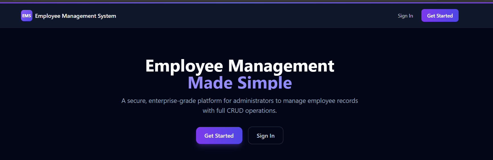
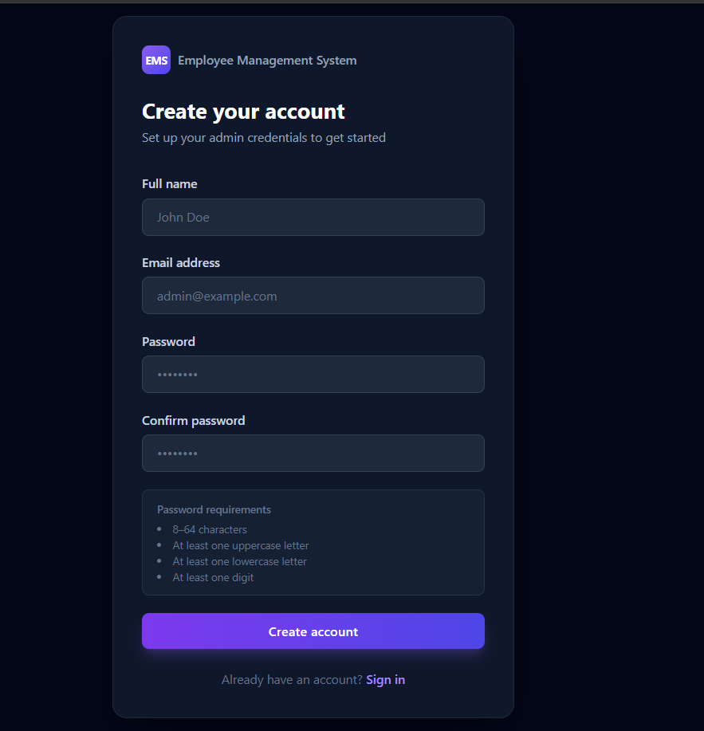
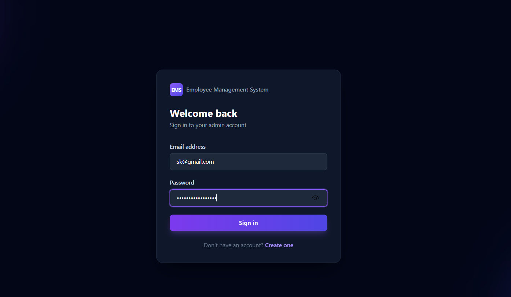
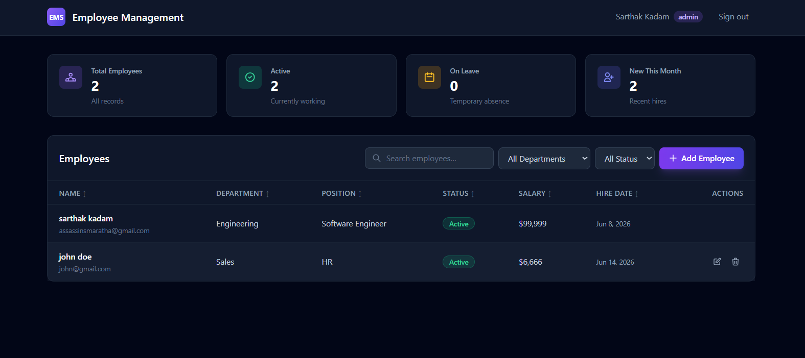

# Enterprise Employee Management Platform

> A full-stack workforce management platform built with React, Node.js, Express, and MongoDB, featuring secure authentication, role-based access control, employee lifecycle management, analytics dashboards, and enterprise-grade architecture.


---

## Overview

Managing employee records, authentication, permissions, and workforce data is a common challenge in modern organizations.

This project simulates a real-world internal business application used by HR and operations teams to manage employees securely and efficiently.

The platform includes:

* Secure JWT Authentication
* Role-Based Access Control (RBAC)
* Employee Lifecycle Management
* Dashboard Analytics
* Search, Filtering & Pagination
* Protected APIs
* Enterprise Security Practices

---

## Key Features

### Authentication & Authorization

* JWT-based authentication
* Password hashing with bcrypt
* Protected routes
* Persistent sessions
* Login rate limiting
* Role-based access foundation (Admin / Manager)

### Employee Management

* Create employees
* View employees
* Update employee records
* Delete employees
* Employee status tracking
* Department management

### Analytics Dashboard

* Total employees
* Active employees
* Employees on leave
* New hires this month

### Data Operations

* Search employees
* Department filtering
* Status filtering
* Sorting
* Pagination

### Security

* JWT verification middleware
* Input validation using express-validator
* Environment variable protection
* Rate limiting
* Password hashing
* Generic authentication error responses

---

## Application Screenshots

### Landing Page



### Registration



### Login



### Dashboard



---

## System Architecture

```text
React + Vite
      │
      ▼
Axios Service Layer
      │
      ▼
Express REST API
      │
      ▼
Authentication Middleware
      │
      ▼
MongoDB Atlas
```

---

## Technical Architecture

### Frontend

* React 18
* Vite
* React Router v6
* Axios
* Tailwind CSS
* Context API

### Backend

* Node.js
* Express.js
* MongoDB Atlas
* Mongoose
* JWT
* bcrypt

### Infrastructure

* Vercel
* Render
* MongoDB Atlas

---

## Engineering Decisions

### Why JWT?

JWT provides stateless authentication, enabling horizontal scaling without server-side session storage.

### Why bcrypt?

Passwords are never stored in plain text. bcrypt provides secure adaptive hashing with salting.

### Why MongoDB?

MongoDB offers flexible document modeling and rapid development for evolving business requirements.

### Why Layered Architecture?

Separating routes, controllers, middleware, models, and services improves maintainability and scalability.

---

## Security Considerations

Implemented:

* Password hashing (bcrypt)
* JWT authentication
* Protected API routes
* Login rate limiting
* Input validation
* Environment variable protection
* Role-based authorization foundation

Future Enhancements:

* Refresh Tokens
* HttpOnly Cookies
* Audit Logs
* Multi-Factor Authentication
* Account Lockout Policies

---

## REST API Endpoints

### Authentication

| Method | Endpoint           | Description                |
| ------ | ------------------ | -------------------------- |
| POST   | /api/auth/register | Register administrator     |
| POST   | /api/auth/login    | Login user                 |
| GET    | /api/auth/me       | Current authenticated user |

### Employees

| Method | Endpoint             | Description          |
| ------ | -------------------- | -------------------- |
| GET    | /api/employees       | List employees       |
| GET    | /api/employees/stats | Dashboard statistics |
| GET    | /api/employees/:id   | Employee details     |
| POST   | /api/employees       | Create employee      |
| PUT    | /api/employees/:id   | Update employee      |
| DELETE | /api/employees/:id   | Delete employee      |

---

## Project Structure

```text
backend/
├── config/
├── controllers/
├── middleware/
├── models/
├── routes/
├── utils/

frontend/
├── components/
├── contexts/
├── pages/
├── services/
├── hooks/
├── utils/
```

---

## Local Development

### Backend

```bash
cd backend
npm install
npm run dev
```

### Frontend

```bash
cd frontend
npm install
npm run dev
```

---

## What This Project Demonstrates

* Full Stack Development
* Authentication & Authorization
* REST API Design
* Database Modeling
* Secure Software Engineering
* State Management
* Enterprise Architecture
* Production-Oriented Development

---

## Future Roadmap

* Advanced RBAC
* Employee Document Management
* Payroll Module
* Attendance Tracking
* Email Notifications
* Audit Logging
* Reporting & Analytics
* Docker Deployment
* CI/CD Pipeline

---

## Author

Sarthak Kadam

B.Tech Computer Science

Focused on Full-Stack Engineering, Backend Systems, and Enterprise Software Development.
